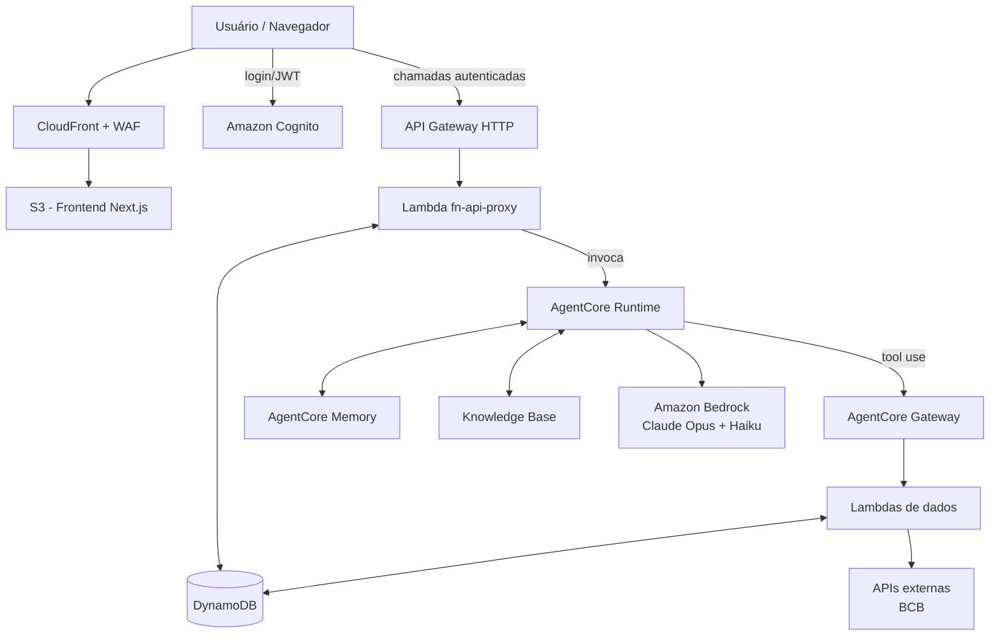

# CAPÍTULO 4 — DESENVOLVIMENTO DO SISTEMA

## 4.1 Visão geral do desenvolvimento

O GEVI é uma plataforma web de apoio à decisão para investidores pessoa física, construída com arquitetura serverless na AWS e núcleo de inteligência artificial baseado no Amazon Bedrock AgentCore. O sistema recebe o investidor na forma de um usuário autenticado, coleta seu perfil de suitability por meio de um questionário, mantém a composição manual da sua carteira e disponibiliza uma assistente conversacional capaz de analisar risco, selecionar ativos e explicar as recomendações em linguagem adaptada ao nível de conhecimento do usuário.

O desenvolvimento foi conduzido de forma incremental, permitindo a implementação e validação progressiva dos principais componentes da plataforma. A solução resultante integra uma aplicação web em Next.js, autenticação pelo Amazon Cognito, uma camada de backend serverless baseada em AWS Lambda e API Gateway, armazenamento em Amazon DynamoDB, uma base de conhecimento gerida pelo Amazon Bedrock Knowledge Base e uma arquitetura multiagente hospedada no Amazon Bedrock AgentCore. Toda a infraestrutura é provisionada como código por meio do AWS Cloud Development Kit (CDK) em Python.

Nas próximas seções, cada camada é apresentada com foco no que foi efetivamente implementado na versão final do sistema. Decisões de projeto que levaram à arquitetura atual, incluindo a redução do número de agentes e a adoção de um modelo dual Opus/Haiku, são descritas na seção 4.9 (Evolução e otimização da arquitetura).

## 4.2 Arquitetura da solução

### 4.2.1 Arquitetura geral

A arquitetura do GEVI é organizada em camadas, cada uma com uma responsabilidade bem definida. A requisição do usuário percorre o seguinte caminho: do navegador até a borda (CloudFront e Amazon S3), passa pela autenticação (Amazon Cognito), chega ao backend (API Gateway e AWS Lambda), atinge o núcleo de agentes (AgentCore Runtime, Gateway, Memory e Knowledge Base) e, por fim, acessa dados persistidos no DynamoDB ou indicadores obtidos de APIs externas.

A Figura 4.1 apresenta a arquitetura final da solução.

Cada camada tem a seguinte responsabilidade:

- **Camada de borda** (CloudFront + S3): entrega global do frontend estático, com proteção do AWS WAF e TLS obrigatório.
- **Camada de autenticação** (Cognito): cadastro, login e emissão de tokens JWT utilizados em todas as chamadas protegidas.
- **Camada de backend** (API Gateway + Lambda proxy): valida o token, encaminha requisições, mantém o estado dos jobs de chat e expõe operações de CRUD da carteira e do histórico de conversas.
- **Camada de agentes** (AgentCore Runtime): hospeda o container do Orquestrador e dos agentes especialistas, que utilizam o Bedrock Converse API para raciocínio e tool use.
- **Camada de ferramentas** (AgentCore Gateway + Lambdas): fornece acesso autorizado às funções que leem dados persistidos e consultam APIs externas.
- **Camada de dados** (DynamoDB + Knowledge Base): armazena perfil, carteira, indicadores, histórico e os documentos de educação financeira indexados por busca semântica.

### 4.2.2 Componentes da arquitetura

Em vez de descrever cada serviço de forma isolada, os componentes são apresentados agrupados pela função que exercem no sistema.

**Entrega do frontend e proteção de borda.** A aplicação web é compilada como um site estático e armazenada em um bucket Amazon S3 privado. A distribuição é feita pelo Amazon CloudFront, com Origin Access Control impedindo o acesso direto ao bucket. Uma Web ACL do AWS WAF (WAFv2) protege a distribuição com regras gerenciadas da AWS e um limite de 2.000 requisições por IP a cada cinco minutos, para mitigar ataques de força bruta e picos anômalos na camada 7.

**Autenticação e identidade do usuário.** O Amazon Cognito User Pool trata o ciclo de vida das contas (cadastro com confirmação por e-mail, login, recuperação de senha) e emite tokens JWT. Cada chamada do frontend ao backend carrega esse token, que é validado tanto pelo API Gateway quanto pela Lambda proxy e, posteriormente, pelo AgentCore Gateway antes de qualquer tool ser executada.

**Backend e orquestração da requisição.** O Amazon API Gateway (HTTP API) expõe as rotas da aplicação com um autorizador JWT nativo. A Lambda `fn-api-proxy` é o ponto único de encaminhamento: ela cria jobs de chat de forma assíncrona, repassa o token do usuário ao AgentCore e serve as operações síncronas de CRUD (perfil, carteira, histórico). A assincronia resolve o teto de 30 segundos do API Gateway sem comprometer a experiência do usuário, graças ao mecanismo de polling descrito na seção 4.3.

**Núcleo multiagente.** O Amazon Bedrock AgentCore é a plataforma que hospeda o sistema multiagente. Quatro recursos são utilizados:

- O **AgentCore Runtime** executa o container Python que implementa o Orquestrador e os agentes especialistas. É um ambiente serverless, com sessões isoladas por usuário via header `Runtime-Session-Id`.
- O **AgentCore Gateway** expõe as ferramentas de dados do sistema sob um único endpoint MCP (Model Context Protocol), com autorização por JWT nativa e integrada ao Cognito.
- O **AgentCore Memory** armazena o histórico de curto prazo (os turnos da conversa) e extrai, de forma assíncrona, preferências e fatos de longo prazo sobre o investidor.
- O **Amazon Bedrock Knowledge Base** fornece a busca semântica sobre o conteúdo educativo utilizado pelo Agente Explicador.

**Modelos de linguagem.** As chamadas aos modelos ocorrem via Bedrock Converse API. O Claude Opus é usado pelo Orquestrador e pelo Agente Explicador, onde a qualidade do raciocínio e da redação importa. O Claude Haiku é usado pelos agentes de Risco e Seleção de Ativos, que produzem apenas notas internas concisas. A justificativa dessa escolha está detalhada na seção 4.5.3.

**Ferramentas e integrações.** As ferramentas acionadas pelo Gateway são implementadas como funções AWS Lambda em Python, cada uma com uma responsabilidade específica: consulta de perfil, consulta de indicadores, análise de portfólio, seleção de ativos, simulação de risco. Uma Lambda adicional é agendada por regra do Amazon EventBridge e consulta periodicamente as APIs públicas do Banco Central do Brasil para atualizar os indicadores econômicos armazenados no DynamoDB.

**Persistência.** O Amazon DynamoDB é o repositório operacional da aplicação, com tabelas separadas para usuários, carteiras, indicadores, histórico, jobs de chat e conversas. Os dados em repouso são protegidos por uma chave gerenciada pelo cliente (CMK) do AWS Key Management Service (KMS).

### 4.2.3 Fluxo de uma solicitação

A trajetória de uma solicitação completa é ilustrada a seguir, tomando como exemplo o pedido "faça uma recomendação completa para a minha carteira":

1. O navegador envia a requisição ao API Gateway com o token JWT do usuário autenticado no Cognito.
2. O API Gateway valida o token pelo autorizador JWT nativo e encaminha para a Lambda `fn-api-proxy`.
3. A Lambda proxy cria um job na tabela `ChatJobs` com estado inicial, dispara um worker assíncrono e devolve ao frontend o identificador do job.
4. O worker invoca o AgentCore Runtime, repassando o mesmo JWT como header de autorização. A sessão é vinculada ao identificador da conversa.
5. O Orquestrador, dentro do Runtime, recebe a mensagem do usuário e lista as ferramentas disponíveis (duas tools diretas e três meta-tools que acionam agentes especialistas).
6. O Orquestrador decide chamar, no mesmo turno e em paralelo, quatro ações: consultar perfil, consultar indicadores econômicos, analisar risco e analisar carteira com seleção de ativos.
7. Cada chamada passa pelo AgentCore Gateway, que revalida o JWT e invoca a Lambda correspondente. As Lambdas acessam o DynamoDB ou os dados do Banco Central, retornam o resultado estruturado.
8. O Orquestrador recebe os quatro resultados e aciona o Agente Explicador, cujo papel é consolidar os achados em uma resposta em português adaptada ao nível de conhecimento do usuário. O Explicador consulta a Knowledge Base para trazer definições complementares quando o perfil é básico.
9. O texto final retorna ao Runtime, que o grava no job de chat. O frontend, que faz polling sobre o job, apresenta a resposta ao usuário.

Durante o processamento, o Runtime grava no job o nome da etapa atual do pipeline (por exemplo, "Analisando sua carteira e selecionando ativos" ou "Preparando a explicação da resposta"). O frontend lê esse campo a cada ciclo de polling e substitui o indicador fixo de carregamento por essa descrição em evolução, oferecendo feedback incremental ao usuário sobre o estado da requisição.

## 4.3 Desenvolvimento da interface web

### 4.3.1 Estrutura da aplicação

O frontend foi implementado em **Next.js 14** com **TypeScript**, utilizando o App Router. A camada de estilização usa **Tailwind CSS**, e a autenticação é mediada pelo **AWS Amplify Auth**, que encapsula o fluxo de login contra o Cognito User Pool e gerencia o ciclo de vida do token JWT no cliente.

A aplicação é compilada como site estático (`next build` com `output: 'export'`), gerando um conjunto de arquivos HTML e JavaScript que é sincronizado com o bucket S3 e distribuído pelo CloudFront. Essa escolha elimina a necessidade de hospedar um servidor Node.js, reduz custos de operação e aproveita o cache de borda do CloudFront para os ativos estáticos. A invalidação do cache após cada deploy é feita por uma chamada ao CloudFront.

A comunicação com o backend ocorre por meio de uma camada única de serviço (`lib/api.ts`), responsável por: (i) adicionar o token JWT em cada requisição; (ii) tratar erros padronizados; (iii) implementar o loop de polling para operações assíncronas, como o chat. Cada tela consome essa camada em vez de chamar `fetch` diretamente, o que mantém o tratamento de autenticação e erro consistente em toda a aplicação.

Os componentes de UI reutilizados (botões, cards, inputs, dropdowns, dialogs) seguem um padrão de design visual único definido no Tailwind, e componentes compostos específicos — como o gráfico de alocação da carteira, o cartão de resumo da conta e o widget de etapa atual do chat — ficam agrupados por domínio em `components/`.

### 4.3.2 Fluxo de interação do usuário

O percurso do usuário no sistema passa pelas seguintes etapas:

1. **Entrada e autenticação**: o usuário acessa a aplicação pelo CloudFront, cria uma conta ou faz login. O Cognito confirma o cadastro por e-mail e emite o token JWT.
2. **Onboarding**: no primeiro login sem perfil, a aplicação apresenta um questionário de suitability composto por seis perguntas. O resultado define o perfil do investidor (Conservador, Moderado ou Arrojado) por pontuação determinística, com uma regra de consistência que rebaixa o perfil Arrojado para Moderado quando a tolerância a perdas declarada é baixa.
3. **Dashboard**: após o onboarding, o usuário é direcionado ao painel principal, que mostra o valor total da carteira, o perfil de risco, a última alteração realizada, a alocação por tipo de ativo em um gráfico e os indicadores econômicos atualizados do Banco Central.
4. **Gestão da carteira**: na tela de Investimentos, o usuário cadastra, edita ou remove ativos, informando nome, tipo e valor. A aplicação deriva automaticamente o percentual de cada ativo em relação ao total.

5. **Interação com a assistente**: na tela de Chat, o usuário envia perguntas em linguagem natural. A aplicação indica a etapa atual do processamento enquanto a resposta é gerada e apresenta o texto final formatado em Markdown, com destaque para disclaimers e eventuais tabelas comparativas.
6. **Minha Conta e Configurações**: a tela de Minha Conta reúne um cartão com nome, perfil e valor da carteira, além de permitir refazer o questionário de suitability. A tela de Configurações expõe preferências do usuário, enquanto a tela de Suporte oferece canais de contato.

### 4.3.3 Principais telas

As principais telas desenvolvidas são descritas a seguir. Capturas estão disponíveis no Apêndice A.

- **Login e Cadastro**: formulários controlados pelo Amplify Auth, com validação em tempo real e tratamento específico para os códigos de erro do Cognito (usuário inexistente, senha inválida, confirmação pendente).
- **Onboarding**: questionário em etapas, com barra de progresso. A navegação entre perguntas é client-side; o resultado só é enviado ao backend ao final.
- **Dashboard**: visão consolidada da carteira e do cenário econômico, com widgets independentes carregados em paralelo. O estado de carregamento é tratado por tela, de modo que falha em um indicador não impede a renderização dos demais.
- **Chat**: interface conversacional com histórico persistido, barra lateral para navegação entre conversas anteriores e indicador dinâmico de etapa do pipeline. A resposta final é renderizada com suporte a Markdown.
- **Investimentos**: tabela de ativos com edição inline, cálculo automático da alocação percentual e validação do tipo de ativo contra os valores aceitos pela lógica de análise do portfólio.
- **Minha Conta**: cartão de resumo, visualização do perfil atual e botão para refazer o questionário. A ação de refazer o questionário é tratada como uma operação explícita, com confirmação, porque sobrescreve o perfil atual.
- **Configurações e Suporte**: telas auxiliares que completam a experiência mas não envolvem lógica de negócio relevante ao núcleo do sistema.

## 4.4 Autenticação e controle de acesso

### 4.4.1 Autenticação com Amazon Cognito

A autenticação dos usuários é gerida por um User Pool do Amazon Cognito provisionado via CDK. O User Pool é configurado para exigir confirmação de e-mail no cadastro, aplicar política de senhas com comprimento mínimo e caracteres variados, e emitir tokens JWT no padrão OpenID Connect.

Durante o login, o Amplify Auth no frontend troca as credenciais do usuário por três tokens: `IdToken` (identidade do usuário), `AccessToken` (autorização para APIs) e `RefreshToken` (renovação dos anteriores). O `IdToken` é utilizado como `Authorization: Bearer <token>` em todas as chamadas à API protegida.

Os claims do token incluem o identificador único do usuário (`sub`), o e-mail verificado e o grupo ao qual pertence. O `sub` é a chave que o backend usa para associar qualquer operação ao usuário correto, isolando dados entre contas.

### 4.4.2 Fluxo de autorização

O fluxo de autorização em uma chamada típica envolve três validações sucessivas do token, cada uma em uma camada diferente do sistema:

1. **API Gateway**: o autorizador JWT nativo valida a assinatura, o emissor (`iss`) e o público (`aud`) do token contra o User Pool do Cognito. Requisições com token inválido são rejeitadas antes de atingir qualquer código próprio.
2. **Lambda proxy**: a função `fn-api-proxy` decodifica novamente o token, extrai o `sub` e usa esse valor como `user_id` em todas as operações subsequentes. O `user_id` nunca é lido do corpo da requisição, o que previne que um cliente malicioso leia ou modifique dados de outro usuário informando um identificador diferente.
3. **AgentCore Gateway**: quando a Lambda proxy invoca o AgentCore Runtime, o mesmo token é repassado no header de autorização. O Runtime o propaga para cada chamada MCP ao Gateway. O Gateway valida o token mais uma vez antes de invocar qualquer tool, garantindo que o próprio container do agente não possa se passar por outro usuário.

Essa cadeia de validações estabelece um padrão de defesa em profundidade: um defeito em uma das camadas, isoladamente, não permite escalada de privilégios ou acesso cruzado entre usuários.

### 4.4.3 Controle de permissões

As permissões entre os serviços são definidas por políticas IAM com o princípio do menor privilégio. Cada função Lambda tem uma role dedicada, com permissões específicas e limitadas às operações necessárias:

- A role da `fn-api-proxy` tem permissão para invocar o AgentCore Runtime, escrever e ler em `ChatJobs` e `ChatConversas`, e operar sobre a tabela `Portfolios`.
- A role de cada Lambda de dados tem permissão apenas sobre as tabelas que efetivamente consulta. Por exemplo, a `fn-consulta-indicadores` tem acesso somente de leitura à tabela `EconomicIndicators`.
- A role do Runtime tem permissão para invocar os modelos Claude (Opus e Haiku) pelos ARNs dos inference profiles e dos foundation models em cada região, acessar o Memory, acessar o Knowledge Base e invocar o Gateway. Não possui acesso direto às Lambdas de dados — todo acesso ocorre pelo Gateway.

Esse isolamento é reforçado pelo **AgentCore WorkloadIdentity**, que emite credenciais efêmeras para a comunicação entre o Runtime e os demais componentes do AgentCore. Dessa forma, não há segredos compartilhados em variáveis de ambiente do container, eliminando a necessidade de rotação de credenciais.

No nível dos agentes, uma propriedade do design assegura que cada agente especialista só tem acesso às ferramentas pertencentes à sua função. O Orquestrador vê a lista completa de ferramentas e meta-ferramentas; o Agente de Risco vê apenas a tool de simulação; o Agente de Seleção de Ativos vê somente as tools de análise de portfólio e seleção; o Agente Explicador vê somente a tool de consulta ao Knowledge Base. Esse isolamento é validado por testes automatizados específicos (seção 4.10).

O resultado é que o GEVI não é um chatbot aberto: cada operação da assistente é mediada por tokens validados em múltiplas camadas, executada por ferramentas com escopo reduzido e isolada por usuário em todas as consultas aos dados.

## 4.5 Desenvolvimento do sistema multiagente

### 4.5.1 Estrutura dos agentes

A arquitetura final do GEVI é composta por **quatro agentes** reais: um Orquestrador que coordena a solicitação e três especialistas que atuam em domínios complementares. Cada agente é uma entidade com seu próprio prompt de sistema, seu próprio modelo de linguagem e seu conjunto restrito de ferramentas.

**Orquestrador.** É o ponto de entrada da camada de agentes. Recebe a mensagem do usuário acrescida do histórico de curto prazo (recuperado do AgentCore Memory) e decide, a cada turno, quais ferramentas invocar. O Orquestrador tem acesso a cinco entradas em sua lista de ferramentas: duas tools diretas (consulta de perfil e consulta de indicadores econômicos) e três meta-tools, cada uma correspondendo à invocação de um agente especialista. Ao final do pipeline, consolida os resultados em uma resposta final ou delega essa consolidação ao Agente Explicador.

**Agente de Risco.** Responsável por caracterizar o perfil de risco da carteira atual do usuário. Executa uma simulação de volatilidade com base em dados históricos, estima a dispersão de retornos esperada e produz uma nota concisa com os principais indicadores de risco (volatilidade anualizada, concentração por tipo de ativo, cenários de perda em janelas de tempo típicas). O output do Agente de Risco é interno — não é apresentado diretamente ao usuário.

**Agente de Seleção de Ativos.** Avalia a composição atual do portfólio e, quando aplicável, seleciona ativos compatíveis com o perfil declarado do investidor. Consulta duas tools: `analisar_portfolio`, que retorna a composição e os percentuais por categoria, e `selecionar_ativos`, que filtra e ranqueia ativos candidatos a partir de critérios de risco e retorno. Produz uma nota concisa com os achados.

**Agente Explicador.** Consolida os achados dos demais agentes e tools em uma resposta em linguagem natural adaptada ao nível de conhecimento do usuário. Possui acesso à Knowledge Base para enriquecer explicações com definições e exemplos de conceitos financeiros quando o perfil do usuário é básico. O Explicador é o único agente cujo output chega integralmente ao usuário final.

A arquitetura inicial do sistema previa seis agentes, com Perfil e Macroeconômico também modelados como agentes independentes. Essas funcionalidades, contudo, não permaneceram como agentes na arquitetura final. Trata-se de operações de leitura sem ambiguidade: a consulta ao perfil retorna um registro do DynamoDB; a consulta aos indicadores econômicos retorna os valores agregados mais recentes do Banco Central. Em ambos os casos, não há raciocínio ou síntese de múltiplas fontes a ser feita por um LLM. Dedicar um agente a essas tarefas significava pagar o custo computacional de pelo menos duas chamadas adicionais ao modelo (uma para decidir chamar a tool, outra para formatar o retorno) sem ganho em qualidade da resposta. A decisão deliberada foi convertê-las em **tools diretas do Orquestrador**, acionadas sem a mediação de um LLM intermediário. Essa transição é detalhada na seção 4.9.

O critério adotado para classificar uma funcionalidade como agente ou como tool direta é objetivo e está documentado no projeto: uma funcionalidade justifica um agente quando envolve julgamento, síntese de múltiplas fontes ou escolha entre caminhos alternativos; caso contrário, é implementada como tool direta.

### 4.5.2 Orquestração das solicitações

O Orquestrador implementa um loop de **tool use** sobre a Bedrock Converse API. A cada turno, o modelo pode: (i) produzir texto final, encerrando o pipeline; ou (ii) retornar uma lista de ferramentas que deseja acionar, com os respectivos argumentos estruturados em JSON. Quando ocorre (ii), o Runtime executa as ferramentas solicitadas, injeta os resultados no histórico e devolve o controle ao modelo para o próximo turno.

Para uma recomendação completa, o Orquestrador decide, logo no primeiro turno, acionar quatro ações em paralelo:

- Consultar perfil (tool direta → `fn-perfil-usuario`)
- Consultar indicadores econômicos (tool direta → `fn-consulta-indicadores`)
- Analisar risco da carteira (meta-tool → Agente de Risco)
- Analisar carteira e selecionar ativos (meta-tool → Agente de Seleção de Ativos)

O paralelismo é obtido com um pool de threads que executa cada chamada em paralelo, preservando a ordem determinística do registro de agentes e ferramentas usadas por meio de callbacks disparados na thread principal, não dentro das threads de execução. Falhas em uma chamada isolada não interrompem as demais: o erro retorna ao modelo como um `toolResult` de status `error`, e o Orquestrador decide se tenta uma rota alternativa ou produz a resposta com as informações disponíveis.

No turno seguinte, com os quatro resultados em mãos, o Orquestrador aciona o Agente Explicador, que recebe as notas internas dos outros agentes e tools, consulta a Knowledge Base quando necessário e produz o texto final adaptado ao perfil do usuário.

O loop encerra por um atalho: quando a resposta do Explicador está disponível, o Orquestrador retorna esse texto diretamente, sem gastar outra chamada ao LLM apenas para "repassar" a resposta final.

Em casos específicos, o Orquestrador opera com uma restrição mais forte. Perguntas que mencionam valores da carteira ou patrimônio (detectadas por uma heurística de palavras-chave) disparam o uso do parâmetro `toolChoice` da Converse API no primeiro turno, forçando a chamada ao Agente de Seleção de Ativos antes de qualquer resposta. Essa restrição estrutural garante que o modelo não produza respostas baseadas apenas em sua memória de longo prazo, que pode estar desatualizada em relação à carteira real do usuário. A partir do segundo turno, o modo volta ao padrão `auto`, deixando que o modelo decida o próximo passo com base nos dados reais já obtidos.

### 4.5.3 Estratégia de utilização dos modelos

O projeto adota uma estratégia dual de utilização de modelos, baseada no papel que cada agente exerce no pipeline:

| Agente | Modelo | Justificativa |
|---|---|---|
| Orquestrador | Claude Opus | Decisão sobre quais ferramentas acionar em pedidos potencialmente ambíguos exige maior capacidade de raciocínio |
| Agente Explicador | Claude Opus | Produz o único texto que o usuário lê diretamente; a qualidade da redação e a adaptação ao nível do usuário são determinantes |
| Agente de Risco | Claude Haiku | Produz apenas uma nota interna concisa a partir de números retornados pela tool; menor latência é preferível |
| Agente de Seleção de Ativos | Claude Haiku | Mesma lógica do Agente de Risco: síntese curta de dados já estruturados |

A escolha é operacional: cada agente carrega o próprio identificador de modelo em sua especificação, propagado pela função de loop de tool use até a chamada efetiva ao Bedrock. A permissão IAM da role do Runtime autoriza explicitamente ambos os inference profiles (Opus e Haiku), em múltiplas regiões, por meio de ARNs listados nominalmente. Essa configuração permite que o sistema aproveite os profiles cross-region do Bedrock, que roteiam a chamada dinamicamente entre regiões conforme a capacidade disponível, ampliando a disponibilidade sem exigir failover implementado pelo cliente.

A principal consequência prática dessa estratégia é a redução de latência e custo nas etapas internas do pipeline, sem perda de qualidade percebida pelo usuário, uma vez que o modelo mais capaz (Opus) permanece nos pontos em que a qualidade do texto importa.

## 4.6 Desenvolvimento das ferramentas e integrações

### 4.6.1 Ferramentas de dados do usuário

As ferramentas de dados do usuário são responsáveis pelo CRUD das entidades que descrevem o investidor e a sua carteira. Duas Lambdas participam diretamente dessa camada:

- `fn-perfil-usuario`: implementa a leitura e a atualização do perfil de investidor na tabela `Users`. É invocada tanto como tool direta pelo Orquestrador (quando o agente precisa conhecer o perfil para formular uma resposta) quanto diretamente pela Lambda proxy (quando o usuário finaliza o questionário de onboarding ou refaz a avaliação pela tela de Minha Conta). A classificação do perfil é determinística, feita por pontuação do questionário com regra de consistência; o LLM apenas redige a justificativa textual associada.
- Acesso à `Portfolios` pela Lambda proxy: o cadastro e a edição da carteira são tratados como operações convencionais da aplicação (não como tool do agente). A proxy escreve diretamente na tabela `Portfolios` ao receber `salvar_portfolio` do frontend, substituindo a carteira do usuário em replace-all e validando o tipo de cada ativo. Essa decisão evita criar uma tool de escrita no Gateway e mantém o padrão já adotado para outras operações de CRUD.

A **leitura da carteira pela IA** continua sendo intermediada pela tool `analisar_portfolio` (Lambda `fn-analise-portfolio`), que lê a mesma tabela. Essa separação deliberada entre o canal de escrita (direto pelo proxy) e o canal de leitura (via Gateway) mantém o isolamento do container do agente das credenciais de escrita.

### 4.6.2 Ferramentas de indicadores econômicos

A obtenção e disponibilização dos indicadores econômicos atualizados segue um padrão de **ingestão agendada + leitura rápida**, implementado por duas Lambdas:

- `fn-consulta-APIs`: executada periodicamente por uma regra do Amazon EventBridge (a cada cinco minutos). Consulta as APIs públicas do Banco Central do Brasil, normaliza as taxas para base anual (por exemplo, converte a Selic diária em taxa anualizada) e persiste os valores na tabela `EconomicIndicators`. Essa Lambda tem permissão apenas de escrita no DynamoDB e de egresso de rede para os endpoints do BCB.
- `fn-consulta-indicadores`: exposta como tool pelo AgentCore Gateway. É invocada pelo Orquestrador para obter o valor corrente da Selic, do IPCA, do CDI e do câmbio Dólar. Calcula também as variações recentes dos indicadores. Tem permissão apenas de leitura sobre a tabela `EconomicIndicators`.

Essa separação entre ingestão e leitura tem dois efeitos. Primeiro, desacopla o tempo de resposta da IA da latência das APIs externas: o modelo não espera uma chamada ao BCB a cada pergunta, pois lê sempre o valor pré-computado. Segundo, atende à boa prática de minimização de privilégios, uma vez que a Lambda chamada pela IA não tem permissão alguma para gravar dados ou acessar a Internet.

Além dessas, duas Lambdas adicionais implementam o raciocínio quantitativo utilizado pelos agentes:

- `fn-calculo-simulacao`: calcula volatilidade e cenários de simulação para o Agente de Risco.
- `fn-selecao-ativos`: filtra e ranqueia ativos candidatos para o Agente de Seleção de Ativos, com base em restrições derivadas do perfil do usuário e dos indicadores correntes.

### 4.6.3 Integração com APIs externas

A integração com APIs externas é feita exclusivamente pela `fn-consulta-APIs`, isolada do caminho síncrono da requisição do usuário. A fonte primária de dados é o conjunto de APIs públicas do **Banco Central do Brasil**, usadas para obter séries temporais da Selic, do IPCA, do CDI e das cotações oficiais do Dólar.

As cotações de ativos operados em bolsa (`B3`) seriam, no estado atual da arquitetura, obtidas por essa mesma rota de ingestão caso o escopo evoluísse para incluir dados de mercado em tempo real. Na versão atual do GEVI, a carteira é de cadastro manual: o usuário informa o valor atribuído a cada ativo, e o sistema analisa a composição com base nesse valor declarado. Isso é coerente com o posicionamento do GEVI como plataforma de apoio à decisão, não como broker ou agregador de dados de mercado em tempo real.

A separação arquitetural entre "ingestão agendada" e "consumo da IA" é propositalmente estrita: nenhuma chamada feita pela IA toca uma API externa diretamente. Falhas momentâneas em APIs externas, portanto, não propagam latência ou erro para o usuário final — no pior caso, os indicadores servidos pela IA são aqueles coletados na última execução bem-sucedida do job de ingestão.

### 4.6.4 Knowledge Base

O **Amazon Bedrock Knowledge Base** fornece a camada de Retrieval-Augmented Generation (RAG) do GEVI. Documentos de educação financeira em formato Markdown são armazenados em um bucket S3 dedicado, ingeridos automaticamente pela KB, fragmentados em chunks, vetorizados e indexados em um cluster do **Amazon OpenSearch Serverless** gerenciado pelo próprio serviço.

A consulta ocorre pela API `Retrieve`, que recebe uma consulta em linguagem natural e devolve os trechos mais relevantes com os respectivos escores de similaridade. Essa API é acionada apenas pelo **Agente Explicador**, por meio da tool `consultar_base_conhecimento`.

O uso da Knowledge Base no sistema cumpre dois objetivos complementares:

1. **Enriquecer explicações para usuários de perfil básico**: quando o perfil do investidor é "básico", o Explicador consulta a KB para trazer definições e exemplos de conceitos financeiros mencionados na resposta (por exemplo, "o que é um fundo imobiliário", "o que é taxa Selic"). Isso evita que a IA produza explicações baseadas apenas em sua memória paramétrica, cujo conteúdo não é auditável.
2. **Fornecer referências sobre instituições e cenários**: o GEVI adota como princípio que afirmações sobre instituições, produtos específicos ou cenários macroeconômicos sejam ancoradas em documentos da KB, com data e fonte. Esse princípio reduz o risco de alucinação do modelo em um domínio em que a desinformação tem impacto financeiro direto.

Para reduzir a latência, as consultas à KB são realizadas em paralelo, no mesmo turno, quando múltiplos conceitos precisam ser esclarecidos. Essa otimização, antes serializada, reduziu uma etapa que podia consumir cerca de 90 segundos para aproximadamente 1,5 segundos.

## 4.7 Persistência de dados e memória

A persistência do GEVI é organizada em duas camadas que atendem a necessidades diferentes: o **Amazon DynamoDB**, usado como banco operacional, e o **AgentCore Memory**, usado como memória da assistente conversacional. Essa separação é deliberada e reflete o tipo de dado que cada uma guarda.

### 4.7.1 Amazon DynamoDB

O DynamoDB armazena os dados operacionais da aplicação em tabelas separadas por entidade. A escolha pelo DynamoDB se baseia em três critérios: latência previsível em single-digit milliseconds, modelo de billing on-demand coerente com cargas variáveis e integração natural com os demais serviços serverless da AWS. Todas as tabelas usam o `userId` do Cognito como chave primária ou como atributo de partição, consolidando o isolamento por usuário na própria modelagem de dados.

As principais tabelas são:

| Tabela | Conteúdo |
|---|---|
| `Users` | Perfil do investidor: respostas do questionário, classificação (Conservador, Moderado, Arrojado), preferências e metadados cadastrais |
| `EconomicIndicators` | Indicadores macroeconômicos coletados periodicamente do Banco Central (Selic, IPCA, CDI, Dólar), normalizados em base anual |
| `Portfolios` | Composição da carteira do usuário: cada ativo com nome, tipo, valor investido e percentual derivado |
| `Historico` | Registros históricos de alterações relevantes utilizados pelas análises |
| `ChatJobs` | Jobs assíncronos de chat, com estado atual, etapa em execução, resultado final e TTL para expiração automática |
| `ChatConversas` | Histórico de conversas: lista as mensagens trocadas em cada conversa, exposto pela barra lateral do chat |

Todas as tabelas são criptografadas em repouso com uma chave gerenciada pelo cliente (CMK) do AWS KMS, cuja política limita o uso aos serviços que efetivamente precisam ler ou escrever esses dados. Os identificadores KMS são injetados nas configurações das tabelas no CDK, de modo que não há como provisionar uma tabela sem criptografia por engano.

Uma particularidade da modelagem é o tratamento das operações de atualização. Para evitar que uma chamada acidental crie um registro inexistente (comportamento padrão do `UpdateItem` do DynamoDB), as operações críticas de update usam `ConditionExpression="attribute_exists(PK)"`. Esse padrão foi adotado após um incidente em que a ausência da condição criou um job de chat vazio durante o reporte de progresso, o que mascarou um erro de observabilidade.

### 4.7.2 AgentCore Memory

O **AgentCore Memory** é o serviço gerenciado que preserva o contexto da assistente conversacional. É dividido em duas dimensões:

- **Memória de curto prazo**: cada evento (turno do usuário e turno da IA) é registrado no Memory, escopado por `actorId = userId` e `sessionId = conversaId`. A cada nova mensagem, o Runtime recupera os eventos recentes dessa sessão e os injeta no histórico apresentado ao LLM. Isso permite que o modelo mantenha o fio do diálogo sem receber a conversa inteira a cada turno, reduzindo o número de tokens processados.
- **Memória de longo prazo**: duas estratégias gerenciadas pela Memory extraem assincronamente preferências e fatos sobre o investidor a partir dos eventos registrados, armazenados em namespaces específicos (`/investidor/<userId>/preferencias` e `/investidor/<userId>/fatos`). A recuperação é feita por busca semântica dentro do namespace do próprio usuário, garantindo isolamento nativo entre contas.

O DynamoDB e o Memory não são redundantes: o DynamoDB serve a interface do usuário (a lista de conversas vista na barra lateral vem da tabela `ChatConversas`) e o Memory serve o contexto do agente (os eventos usados pelo LLM para manter o fio da conversa). Essa abordagem híbrida foi escolhida porque consulta ao Memory é otimizada para o uso do LLM, enquanto a listagem no frontend se beneficia das queries e dos índices nativos do DynamoDB.

Uma observação importante sobre o uso do Memory, descoberta durante o desenvolvimento, é que a memória de longo prazo pode ficar desatualizada em relação ao estado real do usuário. Para dados que exigem precisão em tempo real, como a composição da carteira, a solução foi forçar a consulta à tool correspondente, utilizando o parâmetro `toolChoice` da Converse API (descrito na seção 4.5.2). O Memory passou a ser tratado como fonte de contexto, não como fonte autoritativa de fatos sensíveis.

## 4.8 Segurança da aplicação

A segurança do GEVI é implementada em camadas, com cada mecanismo cobrindo uma superfície diferente de ataque. Esta seção descreve apenas os controles efetivamente provisionados pelo CDK no ambiente de desenvolvimento, não cobrindo elementos que permaneceram em planejamento.

### 4.8.1 Autenticação

A camada de autenticação está centralizada no Amazon Cognito User Pool, conforme descrito na seção 4.4. As principais garantias são:

- Senhas armazenadas pelo Cognito, nunca pelo sistema, com política de complexidade.
- Confirmação por e-mail no cadastro, impedindo que endereços alheios sejam utilizados sem controle.
- Tokens JWT com tempo de vida curto e refresh controlado pelo Amplify Auth no cliente.
- Validação de assinatura, emissor e público do token no API Gateway, antes de qualquer código próprio ser executado.

### 4.8.2 Controle de acesso

O controle de acesso em runtime é implementado por políticas IAM com menor privilégio, como descrito na seção 4.4.3. Vale destacar três pontos adicionais:

- O `user_id` nunca é lido do corpo da requisição; é sempre derivado do token JWT validado. Isso previne que um cliente malicioso tente operar sobre dados de outro usuário.
- O token do usuário atravessa todas as camadas até o AgentCore Gateway. O container do agente não possui identidade suficiente para invocar as Lambdas de tool diretamente, somente por meio do Gateway que faz nova validação do token.
- O **AgentCore WorkloadIdentity** elimina credenciais estáticas na comunicação entre o Runtime e os demais componentes da plataforma de agentes, dispensando a rotação manual de segredos.

### 4.8.3 Proteção dos dados

A proteção de dados em repouso é garantida por uma chave gerenciada pelo cliente (CMK) do **AWS KMS**, provisionada pela stack de segurança do CDK (`SecurityStack`) e referenciada por todas as tabelas DynamoDB e pelos buckets S3 que armazenam dados do usuário. A política da chave segue o princípio do menor privilégio: apenas as roles IAM das Lambdas e do Runtime autorizadas a ler ou gravar em cada recurso têm permissão para usar a chave na operação correspondente.

A proteção em trânsito é feita por TLS 1.2 ou superior, aplicado em todos os pontos de entrada do sistema: CloudFront (perante o navegador), API Gateway (perante o proxy) e endpoints da AWS consumidos pelas Lambdas e pelo Runtime.

### 4.8.4 Proteção da aplicação

A proteção da aplicação na camada 7 é feita pelo **AWS WAF**. Uma Web ACL do WAFv2 é anexada à distribuição CloudFront e inclui dois tipos de regra:

- **Regras gerenciadas da AWS**: grupos pré-configurados que cobrem a OWASP Top 10 (injeção, XSS, cabeçalhos conhecidos de ataque, entre outros).
- **Regra de rate limiting**: bloqueia um endereço IP que exceda 2.000 requisições em uma janela de cinco minutos. É o menor limite permitido pelo WAFv2 para regras baseadas em taxa, suficiente para mitigar enumeração de endpoints e surtos anômalos.

Métricas da Web ACL são publicadas no Amazon CloudWatch com amostragem de requisições, o que permite inspecionar na própria console AWS quais regras disparam ao longo do tempo e qual proporção do tráfego seria bloqueada se o modo de uma regra fosse alterado de "count" para "block". Essa observabilidade é importante durante o ajuste fino das regras gerenciadas, cujos padrões conservadores da AWS podem gerar falsos positivos em uma aplicação específica.

Os controles descritos nesta seção são aqueles efetivamente implementados no CDK e provisionados no ambiente. Documentos de projeto anteriores listavam componentes adicionais (como CloudTrail e integração com AWS Security Hub) como parte da arquitetura planejada; a seção 4.9 e a conclusão do trabalho discutem o que ficou dentro e fora do escopo da versão entregue.

## 4.9 Evolução e otimização da arquitetura

A arquitetura do GEVI não chegou à sua forma final em um único passo. Ao longo do desenvolvimento, três configurações distintas foram implementadas, com a transição entre elas motivada por restrições concretas observadas em medições. Esta seção documenta a trajetória, pois ela esclarece por que a solução final tem a forma que tem.

### 4.9.1 Arquitetura inicial

A primeira implementação consistiu em **um único agente** com acesso direto a todas as ferramentas do sistema. Foi a forma mais simples de validar o fluxo de ponta a ponta: autenticação, chamadas ao Bedrock Converse API, encaminhamento via Gateway e persistência no DynamoDB. Essa versão não isolava domínios de conhecimento, não permitia prompts especializados por função e não oferecia granularidade de permissões por agente.

### 4.9.2 Arquitetura com seis agentes

A segunda implementação introduziu um **Orquestrador** e **cinco agentes especialistas** (Perfil, Macroeconômico, Risco, Seleção de Ativos e Explicador), cada um com seu próprio loop de LLM e acesso restrito às suas tools. Essa configuração atendeu à propriedade de isolamento de ferramentas por agente, exigida pelo design original.

A medição da latência nessa configuração, feita por instrumentação do Runtime com registro da duração de cada chamada ao modelo e ao Knowledge Base, revelou tempos de resposta na ordem de **123 a 137 segundos** para uma recomendação completa. Dois gargalos foram identificados como responsáveis pela maior parte desse tempo:

1. **Chamadas sequenciais quando podiam ser paralelas**: o Orquestrador acionava uma tool, aguardava a resposta e só então acionava a próxima, mesmo quando as tools eram independentes entre si.
2. **Consultas sequenciais ao Knowledge Base pelo Agente Explicador**: cada conceito a esclarecer disparava uma consulta separada, intercalada com uma chamada completa ao LLM para decidir a próxima consulta. Essa etapa, isoladamente, podia consumir cerca de 90 segundos.

### 4.9.3 Redução para quatro agentes

Diante da análise dos gargalos, a decisão de maior impacto estrutural foi reclassificar **Perfil** e **Macroeconômico** como tools diretas do Orquestrador, não mais como agentes. Aplicando o critério descrito na seção 4.5.1, essas duas funcionalidades não envolvem julgamento ou síntese: são leituras determinísticas de dados persistidos. Dedicar um LLM a cada uma significava pagar o custo de pelo menos duas chamadas adicionais ao modelo por operação, sem ganho em qualidade.

A arquitetura passou, então, a quatro agentes reais: Orquestrador, Risco, Seleção de Ativos e Explicador. Do ponto de vista do Orquestrador, as duas funcionalidades reclassificadas aparecem na mesma lista de ferramentas que as meta-tools dos agentes especialistas, com a diferença de implementação invisível ao modelo. Essa mudança reduziu em uma rodada completa de LLM cada consulta a essas informações.

### 4.9.4 Paralelização das chamadas

A Bedrock Converse API permite que o modelo solicite múltiplas ferramentas no mesmo turno, retornando um `stopReason` do tipo `tool_use` com uma lista de blocos `toolUse`. A segunda otimização consistiu em executar essas chamadas em **paralelo** com um pool de threads, em vez de serializá-las como fazia o loop original.

A paralelização exigiu três cuidados complementares. Primeiro, as instruções do Orquestrador e do Explicador foram ajustadas para pedir explicitamente paralelismo: sem essa instrução, o modelo tende a serializar as chamadas por padrão. Segundo, o registro de agentes e ferramentas utilizados precisou ser preservado em ordem determinística, apesar da variabilidade do término das threads; isso foi obtido por meio de callbacks disparados na thread principal, na ordem de submissão das chamadas. Terceiro, falhas em uma chamada passam a ser isoladas: o erro retorna ao modelo como `toolResult` de status `error`, sem interromper as demais.

O mesmo padrão foi aplicado às consultas ao Knowledge Base pelo Agente Explicador: múltiplas consultas sobre conceitos distintos passaram a ocorrer em paralelo, no mesmo turno. Essa mudança, isoladamente, reduziu uma etapa de cerca de 90 segundos para aproximadamente 1,5 segundos.

### 4.9.5 Modelo dual

A terceira otimização foi a adoção de dois modelos diferentes conforme o papel de cada agente, como detalhado na seção 4.5.3. O Orquestrador e o Agente Explicador mantiveram o Claude Opus; os agentes de Risco e Seleção de Ativos migraram para o Claude Haiku, bem mais rápido. Os prompts desses dois agentes foram ajustados para enfatizar concisão, uma vez que seus outputs são apenas notas internas consumidas pelo Orquestrador e pelo Explicador, não textos apresentados ao usuário.

A troca não afetou a qualidade percebida da resposta final, pois o modelo mais capaz permanece nos pontos em que a qualidade do texto importa: a decisão de orquestração e a redação final adaptada ao perfil do usuário.

### 4.9.6 Resultado observado

A instrumentação do Runtime, mantida ativa ao longo das otimizações, permitiu medir o impacto de cada mudança isoladamente. A tabela a seguir resume o progresso para o mesmo cenário de teste (recomendação de investimento completa, mesmo usuário e carteira):

| Configuração | Tempo medido |
|---|---|
| Seis agentes, tudo sequencial, tudo em Opus | ~123–137 s |
| Paralelismo de tool-calls (sem corrigir KB sequencial) | ~132 s (sem ganho líquido) |
| KB em lote + prompts concisos + atalho pós-Explicador | ~88 s |
| Perfil e Macroeconômico como tools diretas (quatro ações no mesmo turno) | ~70 s |
| Modelo dual Opus/Haiku para os agentes internos | **~66–80 s** |

A redução total ficou em torno de **40 a 45%** em relação à versão inicial com seis agentes. A segunda linha da tabela é intencional: evidencia que a paralelização de tool-calls, isoladamente, não produziu ganho líquido enquanto o gargalo real (consultas sequenciais à KB) não foi corrigido. Esse detalhe reforça uma lição metodológica do desenvolvimento: otimização sem medição prévia tende a atacar sintomas, não causas.

### 4.9.7 Feedback incremental da requisição

Uma otimização complementar foi aplicada para reduzir a **latência percebida**, não a latência real. A chamada ao AgentCore Runtime é síncrona do ponto de vista HTTP: durante os 70 segundos típicos do processamento, o frontend não recebe sinal algum, o que leva o usuário a interpretar o silêncio como falha do sistema.

A solução implementada grava, dentro do Runtime, um campo `etapa` no job de chat antes de cada ciclo de ferramentas, com uma descrição em português do que está sendo feito (por exemplo, "Analisando o risco da carteira" ou "Preparando a explicação da resposta"). O frontend, que já consultava o job por polling para saber quando a resposta chegou, passa também a ler esse campo e a apresentar a descrição em evolução no lugar do indicador fixo de carregamento.

A latência real do pipeline não muda com essa alteração. A latência percebida pelo usuário, contudo, cai de forma significativa: o usuário vê, em média, quatro estados informativos distintos ao longo da resposta, em vez de dois minutos de silêncio.

## 4.10 Testes e validação do desenvolvimento

O GEVI possui **77 testes automatizados** executados em cada ciclo de desenvolvimento. A estratégia de teste combina três categorias:

- **Testes de propriedade** (property-based testing com Hypothesis): verificam invariantes do design, não exemplos específicos. Entre os invariantes testados estão o isolamento de ferramentas por agente (nenhum agente especialista pode acessar uma tool que não pertence ao seu domínio), a consistência da classificação de perfil (duas aplicações seguidas do mesmo questionário produzem o mesmo resultado) e o comportamento das análises de risco e portfólio para carteiras arbitrariamente geradas.
- **Testes de integração**: validam o pipeline completo do Orquestrador por meio de fakes que simulam as respostas do modelo e das tools, cobrindo cenários como múltiplas tool-calls paralelas no mesmo turno, falha isolada em uma tool, acionamento do `toolChoice` para perguntas sobre a carteira e uso do atalho de encerramento após o Explicador.
- **Testes unitários**: cobrem as Lambdas individuais e os utilitários compartilhados, verificando contratos de entrada e saída, validação de tipos e tratamento de erros do boto3.

Durante o desenvolvimento, três classes de problemas foram identificadas e corrigidas, cada uma com uma lição que ultrapassa o caso específico:

- **Conversa "ressuscitada" após expiração**: um bug no `UpdateItem` da tabela `ChatJobs` recriava o registro mesmo quando ele havia sido removido pelo TTL, fazendo com que o frontend exibisse a conversa expirada como se ainda estivesse em andamento. A correção foi adicionar `ConditionExpression="attribute_exists(jobId)"` em todas as operações de atualização, de modo que a chamada falhe explicitamente quando o item alvo não existe mais. Esse padrão foi aplicado também em outras operações de atualização sensíveis.
- **Indicador econômico apresentando comparação incorreta**: a tool de consulta de indicadores calculava a variação recente comparando valores sem normalizar a base (diária contra anualizada), produzindo porcentagens inconsistentes. A correção padronizou toda a cadeia de indicadores em base anual, com a conversão feita na ingestão (`fn-consulta-APIs`), e os testes passaram a verificar essa invariante.
- **Utilização de dados obsoletos pela IA**: quando perguntava sobre o valor da carteira, o modelo respondia com valores antigos oriundos da memória de longo prazo, mesmo com uma regra explícita no prompt instruindo a consulta à tool antes de citar qualquer valor. Duas tentativas de correção por meio do prompt falharam. A solução definitiva foi forçar a chamada da tool via `toolChoice` da Converse API, uma restrição estrutural no espaço de resposta do modelo. Esse episódio consolidou um princípio adotado no restante do desenvolvimento: quando o comportamento é crítico, a garantia deve vir da API, não do prompt.

As correções foram acompanhadas de testes específicos que previnem regressão. Por exemplo, dois testes garantem o funcionamento do `toolChoice` para perguntas sobre a carteira: um registra o `tool_choice` passado ao modelo em cada turno e afirma o valor esperado; o outro verifica a heurística de detecção de palavras-chave com oito mensagens típicas parametrizadas.

A estratégia de testes orientada por propriedades e invariantes foi deliberadamente escolhida porque é mais sensível a bugs introduzidos por refatoração do que uma suíte baseada apenas em exemplos. Em um sistema cuja arquitetura mudou três vezes ao longo do desenvolvimento, essa sensibilidade é especialmente valiosa: cada reorganização do pipeline executou centenas de combinações aleatórias de entrada e, ao passar sem falha, deu confiança de que a mudança não quebrou nenhum invariante estrutural do design.
